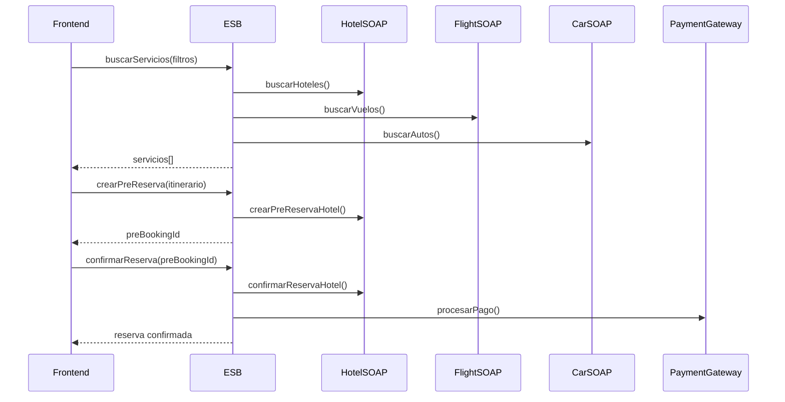

# Enterprise Service Bus (ESB) - Sistema de Integración Booking

## 📋 Descripción

ESB (Enterprise Service Bus) es la capa de integración empresarial que conecta tu aplicación frontend de booking con múltiples servicios SOAP externos (hoteles, vuelos, autos, restaurantes, paquetes turísticos).

## 🏗️ Arquitectura en Capas

```
┌─────────────────────────────────────────────────────────────┐
│                      FRONTEND (booking-mvc)                  │
└──────────────────────────┬──────────────────────────────────┘
                           │
                           ▼
┌─────────────────────────────────────────────────────────────┐
│                    ORCHESTRATION LAYER                       │
│  • Coordina llamadas a múltiples servicios                  │
│  • Maneja respuestas unificadas                             │
│  • Gestiona transacciones distribuidas                      │
└──────────────────────────┬──────────────────────────────────┘
                           │
         ┌─────────────────┼─────────────────┐
         ▼                 ▼                 ▼
┌──────────────┐  ┌──────────────┐  ┌──────────────┐
│  BLL Layer   │  │  DAL Layer   │  │  WS Gateway  │
│              │  │              │  │              │
│ • Validación │  │ • CRUD       │  │ • Adaptadores│
│ • Lógica de  │  │ • Cache      │  │   SOAP       │
│   Negocio    │  │ • Repos      │  │ • Hotel API  │
│              │  │              │  │ • Flight API │
│              │  │              │  │ • Car API    │
└──────────────┘  └──────────────┘  └──────┬───────┘
                                            │
                           ┌────────────────┼────────────────┐
                           ▼                ▼                ▼
                    ┌──────────┐    ┌──────────┐    ┌──────────┐
                    │ Hotel    │    │ Flight   │    │   Car    │
                    │ Service  │    │ Service  │    │ Service  │
                    │  SOAP    │    │  SOAP    │    │  SOAP    │
                    └──────────┘    └──────────┘    └──────────┘
```

## 📁 Estructura de Directorios

```
esb/
├── models/              # Modelos de datos y DTOs
│   ├── entities.ts      # Entidades: Usuario, Reserva, Hotel, Flight, Car, etc.
│   └── dtos.ts          # Data Transfer Objects para SOAP
│
├── dal/                 # Data Access Layer (Repositorios)
│   ├── base.repository.ts
│   ├── usuario.repository.ts
│   ├── reserva.repository.ts
│   ├── pago.repository.ts
│   ├── servicio.repository.ts
│   └── pre-reserva.repository.ts
│
├── bll/                 # Business Logic Layer (Servicios)
│   ├── usuario.service.ts
│   ├── reserva.service.ts
│   └── pago.service.ts
│
├── gateway/             # Web Services Gateway (Adaptadores SOAP)
│   ├── soap-client.ts   # Cliente SOAP base
│   ├── hotel.adapter.ts
│   ├── flight.adapter.ts
│   └── car.adapter.ts
│
├── orchestration/       # Orquestación de Servicios
│   └── orchestrator.ts  # Coordina todas las llamadas
│
├── utils/               # Utilidades
│   ├── soap-utils.ts    # Helpers para SOAP
│   └── config.ts        # Configuración de endpoints
│
└── index.ts             # Punto de entrada principal
```

## 🚀 Uso Rápido

### Importar el ESB en tu aplicación

```typescript
import ESB from './esb';

// Ejemplo de uso
async function ejemploBusqueda() {
  const resultados = await ESB.buscarServicios({
    serviceType: ['hotel', 'flight', 'car'],
    ciudad: 'Quito',
    fechaInicio: new Date('2025-12-01'),
    fechaFin: new Date('2025-12-10'),
    adults: 2,
    children: 0,
    precioMin: 50,
    precioMax: 500
  });
  
  console.log(`Encontrados ${resultados.length} servicios`);
}
```

## 📚 API Principal

### Búsqueda e Integración

```typescript
// Buscar servicios
const servicios = await ESB.buscarServicios(filtros);

// Obtener detalle de un servicio
const detalle = await ESB.obtenerDetalleServicio('hotel-123', 'hotel');

// Verificar disponibilidad
const disponible = await ESB.verificarDisponibilidad(
  'hotel-123', 'hotel', fechaInicio, fechaFin, 2
);

// Cotizar reserva
const cotizacion = await ESB.cotizarReserva(detalles);

// Crear pre-reserva (bloqueo temporal)
const preReserva = await ESB.crearPreReserva(
  itinerario,
  { nombre: 'Juan', email: 'juan@example.com' },
  30 // minutos
);

// Confirmar reserva
const reserva = await ESB.confirmarReserva(
  preBookingId,
  'tarjeta',
  { cardNumber: '****' }
);

// Cancelar reserva
await ESB.cancelarReserva(bookingId, 'Cliente canceló');
```

### Gestión de Usuarios

```typescript
// Obtener todos los usuarios
const usuarios = await ESB.usuarios.obtenerTodos();

// Crear usuario
const nuevoUsuario = await ESB.usuarios.crear({
  nombre: 'Juan',
  apellido: 'Pérez',
  email: 'juan@example.com',
  activo: true
});
```

### Gestión de Reservas

```typescript
// Obtener reservas de un usuario
const reservas = await ESB.reservas.obtenerTodas('usuario-123');

// Crear reserva
const idReserva = await ESB.reservas.crear(reservaData);

// Confirmar reserva
const confirmada = await ESB.reservas.confirmar(idReserva);

// Cancelar reserva
await ESB.reservas.cancelar(idReserva);
```

### Gestión de Pagos

```typescript
// Crear pago
const idPago = await ESB.pagos.crear({
  idReserva: 'reserva-123',
  monto: 500,
  currency: 'USD',
  metodoPago: 'tarjeta'
});

// Capturar pago
await ESB.pagos.capturar(idPago);

// Reembolsar pago
await ESB.pagos.reembolsar(idPago);
```

## ⚙️ Configuración

### Configurar endpoints de servicios SOAP

```typescript
import { updateESBConfig } from './esb';

updateESBConfig({
  endpoints: {
    hotel: {
      url: 'http://hotel-service.com/soap',
      namespace: 'http://booking.esb/hotel',
      timeout: 30000,
      enabled: true
    },
    flight: {
      url: 'http://flight-service.com/soap',
      namespace: 'http://booking.esb/flight',
      timeout: 30000,
      enabled: true
    },
    car: {
      url: 'http://car-service.com/soap',
      namespace: 'http://booking.esb/car',
      timeout: 30000,
      enabled: true
    }
  }
});
```

## 🔧 Especificación de APIs SOAP

### Métodos implementados según la especificación

#### USUARIOS (Gestión Interna)
- `obtenerUsuarios()` → List<Usuario>
- `obtenerUsuarioPorId(idUsuario)` → Usuario
- `crearUsuario(usuario)` → Usuario
- `actualizarUsuario(idUsuario, usuario)` → Usuario
- `eliminarUsuario(idUsuario)` → boolean

#### RESERVAS (Gestión Interna)
- `obtenerReservas()` → List<Reserva>
- `obtenerReservaPorId(id)` → Reserva
- `crearReserva(reserva)` → id
- `actualizarReserva(id, reserva)` → Reserva
- `cancelarReserva(id)` → boolean

#### PAGOS (Gestión Interna)
- `obtenerPagos()` → List<Pago>
- `obtenerPagoPorId(id)` → Pago
- `crearPago(pago)` → id
- `capturarPago(id)` → Pago
- `reembolsarPago(id)` → Pago

#### INTEGRACIÓN EXTERNA (Serial Bus)
- `buscarServicios(filtros)` → List<Servicio>
- `obtenerDetalleServicio(idServicio)` → Servicio
- `verificarDisponibilidad(sku, inicio, fin, unidades)` → boolean
- `cotizarReserva(items[])` → Cotizacion
- `crearPreReserva(itinerario, cliente, holdMinutes)` → PreReserva
- `confirmarReserva(preBookingId, metodoPago)` → Reserva
- `cancelarReservaIntegracion(bookingId, motivo)` → boolean

## 📝 Modelos de Datos

### Hotel/Room
```typescript
interface Hotel {
  hotelId?: string;
  nombre: string;
  ciudad: string;
  roomType: 'Standard' | 'Deluxe' | 'Suite' | 'Executive';
  numberBeds: number;
  occupancy: { adults: number; children: number };
  board: 'BB' | 'MP' | 'AI' | 'RO';
  checkIn: Date;
  checkOut: Date;
  amenities: string[];
  breakfastIncluded: boolean;
  pricePerNight: number;
  currency: string;
}
```

### Flight/Leg
```typescript
interface Flight {
  flightId?: string;
  origin: string; // IATA
  destination: string; // IATA
  airline: string;
  flightNumber: string;
  departureTime: Date;
  arrivalTime: Date;
  duration: string;
  cabinClass: 'Economy' | 'Business' | 'First';
  price: number;
  currency: string;
}
```

### Car/Vehicle
```typescript
interface Car {
  carId?: string;
  agencyId: string;
  city: string;
  marca: string;
  modelo: string;
  category: 'economy' | 'suv' | 'luxury';
  gearbox: 'AT' | 'MT';
  pickupAt: Date;
  dropoffAt: Date;
  pricePerDay: number;
  currency: string;
}
```

## 🔄 Flujo de Reserva



## 🛠️ Características

✅ **Orquestación de Servicios**: Coordina llamadas a múltiples APIs SOAP  
✅ **Caché Local**: Almacena servicios en repositorios in-memory  
✅ **Retry Logic**: Reintentos automáticos en caso de fallo  
✅ **Idempotencia**: Previene duplicados con idemKeys  
✅ **Pre-Reservas**: Sistema de bloqueo temporal  
✅ **Logging**: Registro completo de operaciones  
✅ **Tipado Fuerte**: TypeScript en toda la arquitectura  
✅ **Modular**: Fácil de extender con nuevos servicios  

## 📊 Logging

```typescript
import { ESBLogger } from './esb';

const logger = ESBLogger.getInstance();

// Ver logs
const logs = logger.getLogs();
console.log(logs);

// Limpiar logs
logger.clearLogs();
```

## 🧪 Testing

```typescript
// TODO: Agregar tests unitarios e integración
// - Unit tests para cada adaptador
// - Integration tests con mocks de SOAP
// - E2E tests del flujo completo
```

## 🚧 Próximos Pasos

- [ ] Implementar adaptadores para Restaurant y Package
- [ ] Agregar autenticación/autorización SOAP
- [ ] Implementar circuit breaker pattern
- [ ] Agregar métricas y monitoring
- [ ] Persistencia real (base de datos)
- [ ] Tests unitarios y de integración
- [ ] Documentación OpenAPI/Swagger

## 📞 Contacto

Para preguntas o soporte, contacta al equipo de desarrollo.

---

**Creado con ❤️ para el proyecto Booking MVC**
